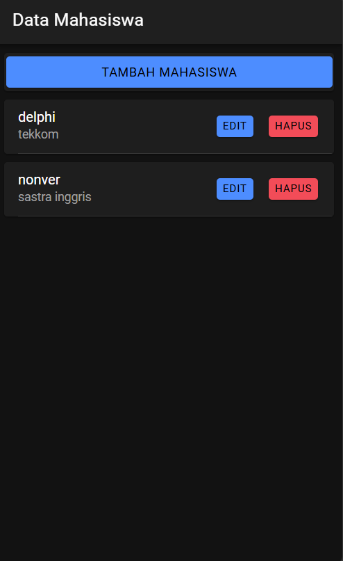
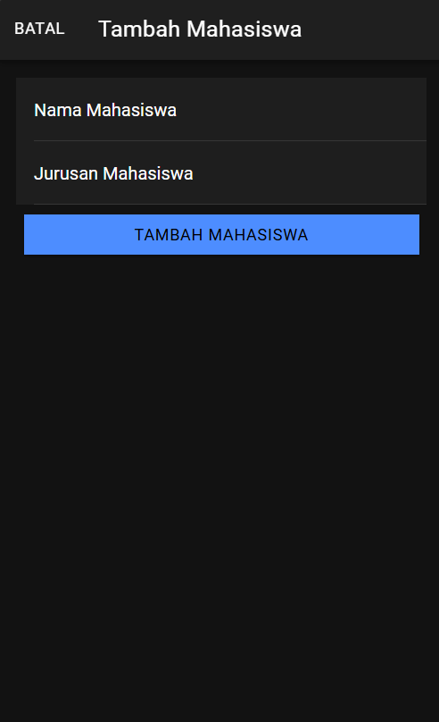
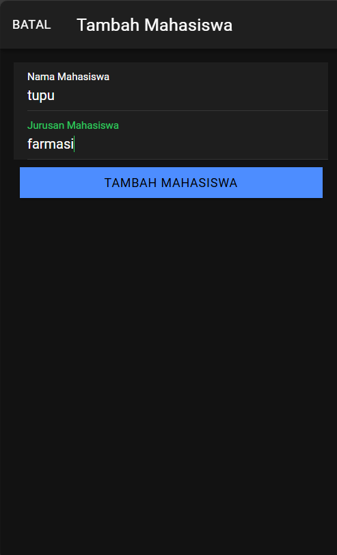
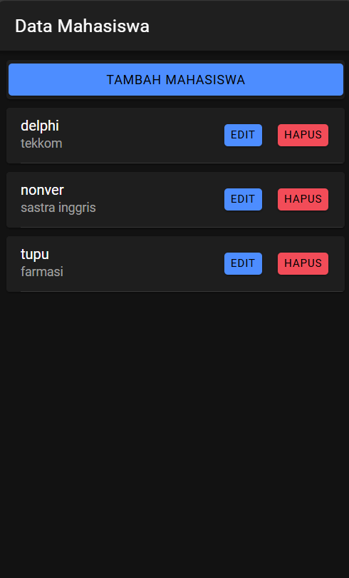
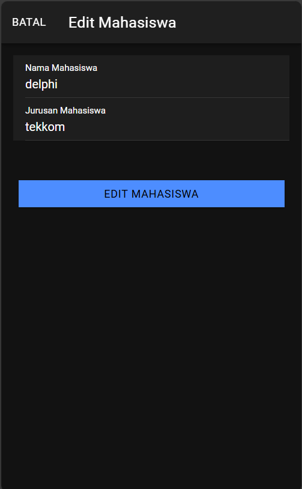
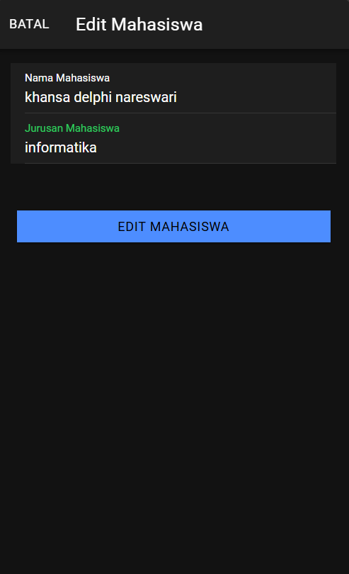
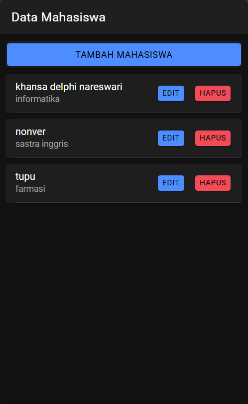
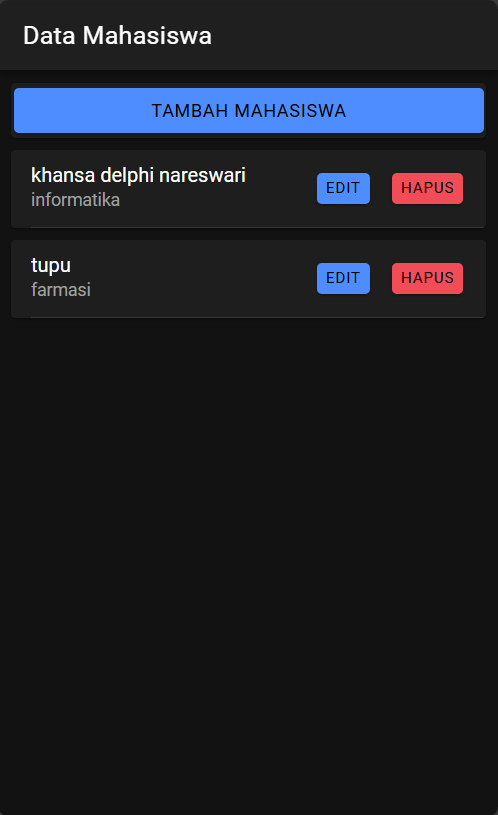
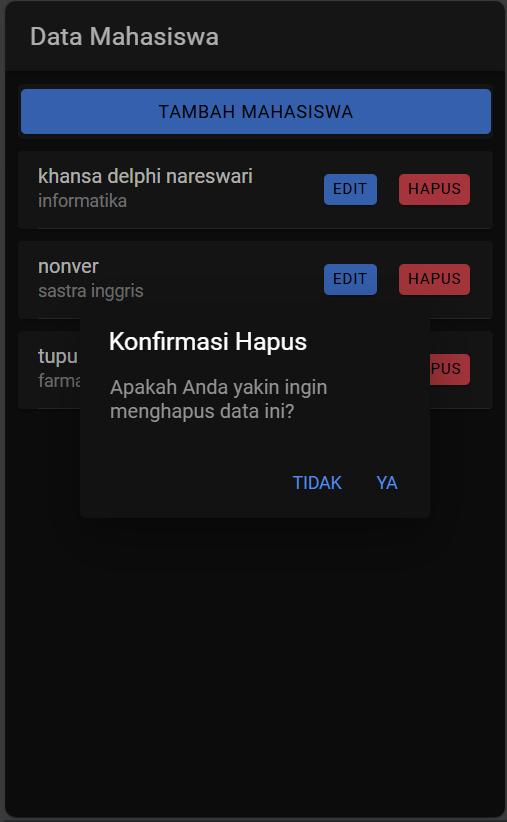

# LabMobile8_Khansa-Delphi_H1D022038

## Screenshot dan Cara Kerja
1. **Menampilkan Data**

- Fungsi `getMahasiswa()` di `mahasiswa.page.ts`
```
getMahasiswa() {
  this.api.tampil('tampil.php').subscribe({
    next: (res: any) => {
      console.log('sukses', res);
      this.dataMahasiswa = res;
    },
    error: (err: any) => {
      console.log(err);
    },
  });
}
```
`getMahasiswa()` dipanggil saat komponen diinisialisasi (ngOnInit()), sehingga data mahasiswa akan langsung diambil dari server ketika halaman dibuka. Metode `this.api.tampil('tampil.php')` memanggil fungsi `tampil()` di ApiService yang mengirimkan request GET ke `tampil.php` di backend. `tampil.php` di server akan mengeksekusi query SQL untuk mengambil semua data dari tabel mahasiswa dan mengembalikannya dalam format JSON. Data yang diterima (res) disimpan dalam variabel `dataMahasiswa`, yang kemudian digunakan untuk binding data ke elemen HTML menggunakan direktif Angular *ngFor.
- File `mahasiswa.page.html`
```
<ion-card *ngFor="let item of dataMahasiswa">
  <ion-item>
    <ion-label>
      {{item.nama}}
      <p>{{item.jurusan}}</p>
    </ion-label>
    <ion-button expand="block" (click)="openModalEdit(true, item.id)">Edit</ion-button>
    <ion-button color="danger" slot="end" (click)="confirmHapus(item.id)">Hapus</ion-button>
  </ion-item>
</ion-card>
```
*ngFor digunakan untuk mengulangi setiap item dalam dataMahasiswa dan menampilkan nama serta jurusan mahasiswa di dalam elemen ion-card.

2. **Menambah Data**


- Fungsi `tambahMahasiswa()` di `mahasiswa.page.ts`
```
tambahMahasiswa() {
  if (this.nama != '' && this.jurusan != '') {
    let data = {
      nama: this.nama,
      jurusan: this.jurusan,
    }
    this.api.tambah(data, 'tambah.php')
      .subscribe({
        next: (hasil: any) => {
          this.resetModal();
          console.log('berhasil tambah mahasiswa');
          this.getMahasiswa();
          this.modalTambah = false;
          this.modal.dismiss();
        },
        error: (err: any) => {
          console.log('gagal tambah mahasiswa');
        }
      })
  } else {
    console.log('gagal tambah mahasiswa karena masih ada data yg kosong');
  }
}
```
Pada fungsi ini, data (nama dan jurusan) dikumpulkan dari input user yang diikat dengan [(ngModel)]. Sebelum data dikirim, dilakukan validasi sederhana untuk memastikan input tidak kosong. Jika validasi lolos, data dikemas dalam objek data dan dikirimkan ke `tambah.php` melalui metode POST menggunakan fungsi `tambah()` di ApiService. `tambah.php` pada server akan memproses data yang diterima dan menyisipkannya ke database. Jika operasi berhasil, modal ditutup `(this.modal.dismiss())` dan data diperbarui dengan memanggil `getMahasiswa()`.
Dapat dilihat bahwa data berhasil ditambahkan


3. **Edit Data**


- Fungsi `editMahasiswa()` di `mahasiswa.page.ts`
```
editMahasiswa() {
  let data = {
    id: this.id,
    nama: this.nama,
    jurusan: this.jurusan
  }
  this.api.edit(data, 'edit.php')
    .subscribe({
      next: (hasil: any) => {
        console.log(hasil);
        this.resetModal();
        this.getMahasiswa();
        console.log('berhasil edit Mahasiswa');
        this.modalEdit = false;
        this.modal.dismiss();
      },
      error: (err: any) => {
        console.log('gagal edit Mahasiswa');
      }
    })
}
```
Data yang akan diedit dikumpulkan dari input user yang sudah terisi (hasil dari fungsi `ambilMahasiswa()` yang mengambil data mahasiswa berdasarkan ID). Data yang akan diubah (termasuk id, nama, dan jurusan) dikemas dalam objek data dan dikirimkan ke `edit.php` melalui metode PUT.`edit.php` akan memperbarui data di database berdasarkan ID yang dikirimkan. Jika operasi berhasil, data ditampilkan ulang dengan memanggil `getMahasiswa()` dan modal ditutup.
Disini data berhasil di edit


4. **Hapus Data**
- Fungsi `hapusMahasiswa()` di `mahasiswa.page.ts`
```
hapusMahasiswa(id: any) {
  this.api.hapus(id, 'hapus.php?id=').subscribe({
    next: (res: any) => {
      console.log('sukses', res);
      this.getMahasiswa();
      console.log('berhasil hapus data');
    },
    error: (error: any) => {
      console.log('gagal');
    }
  })
}
```
Fungsi ini menerima ID mahasiswa yang akan dihapus. Menggunakan fungsi `hapus()` dari ApiService, request DELETE dikirimkan ke `hapus.php` dengan menyertakan ID mahasiswa sebagai parameter. `hapus.php` di server akan menghapus data dari database berdasarkan ID yang diberikan. Jika berhasil, data di-refresh dengan memanggil `getMahasiswa()` untuk menampilkan data terbaru tanpa item yang telah dihapus.
Disini saya menghapus data mahasiswa nonver


5. **Bonus**
- Konfirmasi Hapus
Disini saya menambahkan konfirmasi hapus di `mahasiswa.page.html`
```
<ion-button color="danger" slot="end" (click)="confirmHapus(item.id)">Hapus</ion-button>
```
```
async confirmHapus(id: any) {
    const alert = await this.alertController.create({
      header: 'Konfirmasi Hapus',
      message: 'Apakah Anda yakin ingin menghapus data ini?',
      buttons: [
        {
          text: 'Tidak',
          role: 'cancel',
          handler: () => {
            console.log('Penghapusan dibatalkan');
          }
        },
        {
          text: 'Ya',
          handler: () => {
            this.hapusMahasiswa(id); // Panggil fungsi hapus jika user memilih "Ya"
          }
        }
      ]
    });

    await alert.present();
  }
```
Berikut tampilan konfirmasi hapusnya
